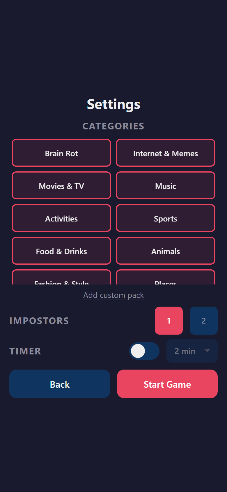
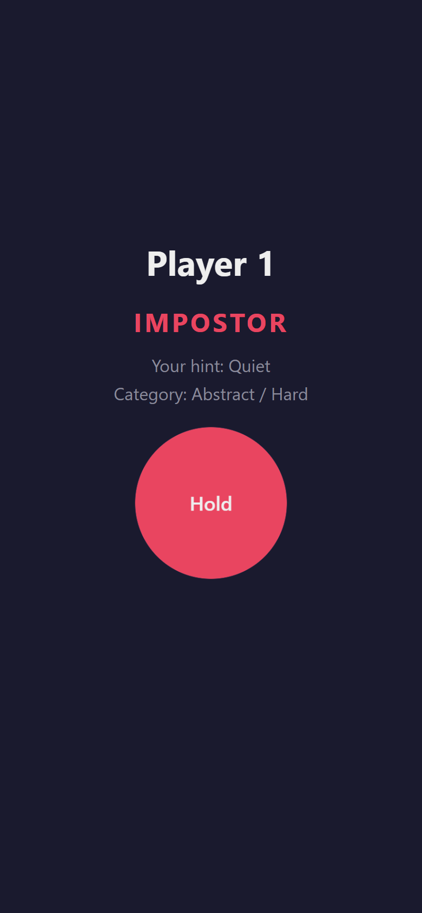
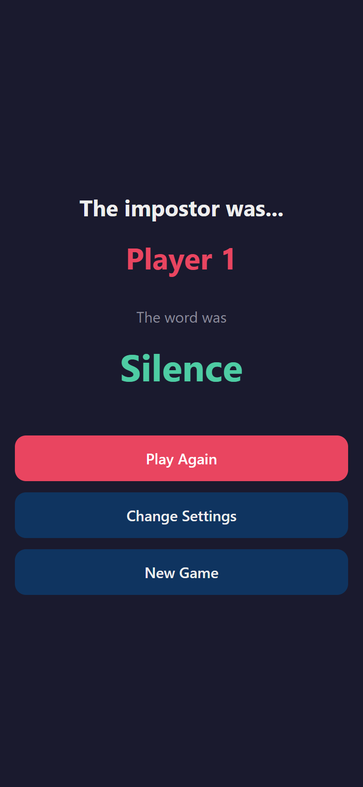

# Impostor

Pass-and-play party game — one phone passed around the room. Everyone gets a secret word except the impostor, who has to fake it. Give one-word clues, argue about it, vote someone out.

<p align="center">
  
  &nbsp;
  
  &nbsp;
  
  &nbsp;
  
  &nbsp;
  
</p>

## Play it

Hosted on GitHub Pages: **https://nemily.github.io/impostor-game/**

Or run it locally — it's just static files, no build step:

```
npx http-server . -p 8080
```

Then open http://localhost:8080 on your phone.

## How it works

1. Add 3+ players
2. Pick word categories (Brain Rot, Movies, Music, etc.) or make your own
3. Pass the phone around — each player holds a button to peek at their word
4. One player is secretly the impostor and doesn't know the word
5. Take turns giving one-word clues, discuss, vote on who's faking it

## Features

- **Hold-to-reveal** — hold a button to peek at your word, release to hide it
- **15 built-in word packs** with 500+ words and hints
- **Custom word packs** — add your own
- **Timer** — optional round timer (1–10 min)
- **1 or 2 impostors**
- **Offline-first PWA** — works without internet, installable to home screen
  - On iOS: tap Share → "Add to Home Screen"

## Tech

Pure HTML/CSS/JS. No frameworks, no build step, no dependencies. Hosted on GitHub Pages.
